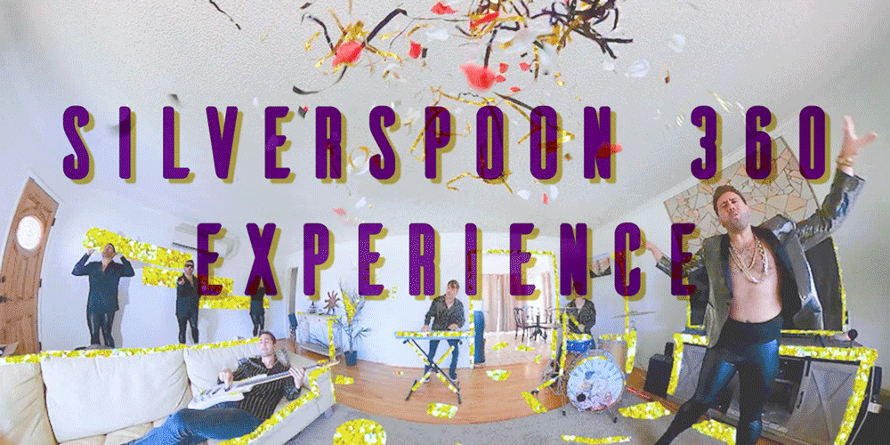

# <a href="https://silverspoon360.com" target="_blank">silverspoon360.com</a>

## Become the camera operator for this immersive music video experience.

## About
My friend Danny is a successful touring drummer for a few different acts ([Rhye](https://www.rhyemusic.com/), [Great Good Fine OK](https://www.greatgoodfineok.com/)) as well as a sought after studio musician (he plays pretty much every instrument but his meat and potatoes is percussion). He's currently based out of LA and during the pandemic has been churning out a ton of amazing content with his own band known as [Wolf & Love](https://www.wolfandlove.com/). 

One such piece of content is a very engaging "live" [360 degree music video](https://www.youtube.com/watch?v=dw2s4GqbXZM) for the band's song "Silverspoon". I was blown away by the video when I first saw it. Like...it is truly unlike anything I've ever seen and it perfectly captures the state of the world we live in during all this 2020 insanity. It really shows what these two guys can do with a bunch of instruments and a single camera while quarantined away in their living room.

Anyways, after seeing this video, I hit Danny up and asked if he'd be interested in me attempting to make a website for the video. After a few minutes of me throwing stupid ideas at him Danny said, "Well...I had originally thought it would be fun to make the video sort of like a treasure hunt". That was all I needed and over the next week I build silverspoon360.com.

## Want a similar website?
If you are interested in making a similar website, or have any questions about this one, feel free to contact me hello@efficiencyjunky.com

I realize that the source code is all here on github, so if you wanted to just clone this repo and make a similar website that is possible, but there are a lot of things that I would need to request you to change (removing the GTM Tag, changing meta tags, removing references to the current video etc.) before cloning it, hence my request to be contacted first.

Anyways, I hope you at least get a chance to at least check out https://silverspoon360.com and maybe something in this repo will be useful.
